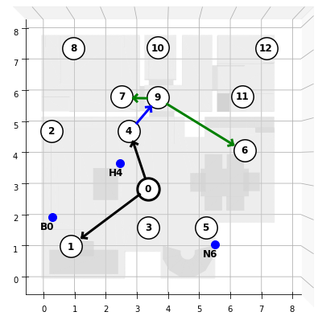

# Synchronization Of Dynamic WASN

Python implementation of simulation framework used for production of experimantal results published in the paper **Online distributed waveform-synchronization for acoustic sensor networks with dynamic topology** written by Aleksej Chinaev, Niklas Knaepper and Gerald Enzner



The simulation framework uses Python scripts and a notebook to present the online distributed waveform-based synchronization of wireless acoustic sensor networks with dynamic topology: A Jupyter-Notebook with a demo of the simulation framework
- distributed_synchro_dynTop.ipynb

and the step-by-step Python main scripts, developed for the following tasks:
- Draw groups of nodes for which topologies are generated in the simulation (simulation_1_draw_nodeGroups.py)
- Simulate WASN operation for previously drawn node groups (simulation_2_simulate_WASNs.py)
- Evaluate simulation results such as RMSE, AMSC and SSNR (simulation_3_evaluate.py)
- Load and sort evaluation results to produce the final plots (simulation_4_summarize_and_plot.py)


## 1 List of dependencies

- numpy 1.24.4
- numpy-stl 3.0.1
- tqdm 4.62.3
- scipy 1.8.0
- matplotlib 3.7.2
- paderbox 0.0.3
- paderwasn 0.0.0
- lazy-dataset 0.0.12


## 2 WASN signal database

Please download the database of simulated node signals and relevant metadata from:
[https://cloud.uol.de/s/dq5SCkLg7yPHgC3](https://cloud.uol.de/s/dq5SCkLg7yPHgC3) and place the files inside the `data/` directory.

### 2.1 Data properties

All acoustic source signals exhibit a reference sampling rate of 16 kHz.

While clean speech signals are taken from the LibriSpeech corpus, a music source is downloaded from the Freesound datasets.

The resulting microphone signals are superimposed by uncorrelated computer-generated sensor noise of constant power yielding a global signal-to-noise ratio (SNR) of around 33 dB averaged over all sensor nodes.

### 2.2 Organization of data

- room_models.stl
- json/
   - positions.json
   - testbed.json
- audio/
   - example_0_async/
      - node_[ID]_mic_[ID].wav
   - example_0_sync/
      - node_[ID]_mic_[ID].wav


## 3 Exploring an exemplaray WASN and its modification

The jupyter-notebook `distributed_synchro_dynTop.ipynb` enables to explore a specific WASN topology and arbitrary modifications applied to it.

### 3.1 Demo configuration

Confirm that `DATA_ROOT` points to the location of the core database. You can adjust the duration of WASN simulation in `sig_lec_sec`.

#### 3.1.1 Configuration of WASN topology and network change

Every topology is managed by an instance of the `TopologyManager` class, which automatically constructs the optimal topology for any given set of nodes and further exposes an abstract interface for all possible modifications, while handling the algorithmic details, as described in the publication, under the hood. Note that `TopologyManager` only manages the topology and its modification, but not the WASN simulation itself.

The current topology, be it after initialization or a specific modification applied, can always be accessed via the `nodes_levels` attribute.

Use `node_ids_start` to define the list of all nodes in the initial WASN, where nodes are referred to by their numerical id. `node_ids_start` may contain any node id ranging from 0 to 12.

The timepoint of network modification can be defined using `Tc_sec`.

With `wasn_modification`, you can toggle between one of four pre-defined network modifications, each corresponding to one of the four fundamental types of modification. Valid values are 1, 2, 3 and 4:
1. Appearance of a new node
2. Failure of a communication link 
3. Failure of a non-reference sensor node 
4. Failure of the reference sensor node

Refer to the following summary for details on how to change specific modifications:

1. `TopMng.add_nodes(node_coords)` Adds one or more nodes to the network. `node_coords` is a dictionary, where the keys are node ids (int) and values specify the coordinates (list). Node coordinates can be accessed via the `node_coord()` function.
   - Example: `TopMng.add_nodes({4: node_coord(4)})`
2. `TopMng.set_node_links(links, state)` enables or disables links between nodes. `links` is a list where each element is itself a list of two node ids, representing the link between them. Use `state=True` to enable and `state=False` to disable links.
   - Example: `TopMng.set_node_links([[6, 9]], False)`

3. `TopMng.remove_nodes(nodes)` Removes one or more nodes from the network. `nodes` is a list of numerical node ids. Note: This method can be used to remove non-reference, as well as reference nodes.
   - Example: `TopMng.remove_nodes([1])`

Figure 1: "Initial WASN" and Figure 2: "Modified WASN" show the geometry of the WASN within the virtual apartment, as well as the configured topology, before and after the network modification Connections between nodes are indicated via arrows.

### 3.2 Loading of Audio- and Metadata
Execute this cell to load all node audio signals and relevant metadata

### 3.3 Dynamic WASN simulation and evaluation results
Execute this cell to run the actual WASN simulation. During the simulation, the network switches to the modified WASN topology at the specified time point.

#### 3.3.1 Visualization of SRO trajectories
In Figure 5: "SRO estimation and residual SRO estimation", the upper plot displays each nodes estimated SRO over time, where the dashed lines indicate the true (relative) SRO for each node.
Similarily, the lower plot displays the corresponding residual SRO estimates, which should always converge to zero.
The black, dashed line in both plots marks the time-point of network modification `Tc_sec`.

#### 3.3.2 Evaluation results
Execute these cells to run the evaluation for both before, and after the network modification.

#### 3.3.3 Visualization of evaluation results
Figure 6: "Performance evaluation: SRO-RMSE, AMSC and SSNR" summarizes the WASN performance before and after the network modification using boxplots via the following metrics:
- Root mean square error (RMSE) of SRO estimation
- Averaged magnitude squared coherence (AMSC) of asynchronous and synchronized signals
- Signal to synchronization noise ratio (SSNR) of asynchronous and synchronized signals

Note that these plots differ from those included in the publication in that they only communicate the performance of a single WASN in one scenario.

## 4 Running the complete simulation

Warning: For the given set of 50 initial WASN topologies in `node_topologies.pkl`, the complete set of simulation and evaluation results is about **66GB**. Please make sure to have enough disk space available or, alternatively, utilize a smaller set of topologies (see 3.1).

### 4.1 Drawing random topologies

If you wish to run the simulation with a set of random topologies, different from that used in the publication, use the script `simulation_1_draw_topologies.py`. You may adjust the following parameters:
- `TARGET_FILE`: The exported file containing the generated set of topologies.
- `t_range_switch`: Interval from which a random time-point of network modification will be drawn for each initial WASN topology.
- `N_topologies`: Number of random topologies to draw.
- `N_range_init`: Interval from which the number of nodes in each initial WASN is drawn.

You can skip this step and use the provided file `node_topologies.pkl`, which allows to reproduce the results shown in the publication.

### 4.2 Simulating WASN operation

The script `simulation_2_simulate_WASNs.py` simulates WASN operation for every topology in the previously drawn set, including the network modification of the specified type. By default, this is done using the provided set of random topologies. To run the simulation based on your custom set of topologies, please set `FLAG_CUSTOM_SIMULATION=True` and optionally adjust the paths in `TOPOLOGIES_FILE` and `SIM_TARGET_DATA_ROOT`.

In order to generate a complete set of simulation results, **this script needs to be executed 4 times in total**, once for each of the four possible modification scenarios configured via `WASN_MODIFICATION`.

The following provides an overview over the adjustable parameters:

- `FLAG_CUSTOM_SIMULATION`: Flag to conveniently toggle between default and custom paths.
- `SIM_TARGET_ROOT`: Root directory where all simulation (and evaluation) results will be stored.
- `TOPOLOGIES_FILE`: Path to the file containing the generated set of topologies. Usually, this will be inside the directory specified in SIM_TARGET_ROOT.
- `DATA_ROOT`: Directory of the core database, containing node audio signals and other metadata.
- `WASN_MODIFICATION`: Specifies the type of modification that is simulated. Can be one of the following: "join", "leave", "unlink", "leave_root".
- `sig_len_sec`: Simulation length in seconds.

### 4.3 Evaluation of simulation results

`simulation_3_evaluate.py` is used to evaluate the results of the previously simulated WASN operation. Specifically, the following evaluation metrics are computed:
- Root mean square error (RMSE) of SRO estimation
- Settling time of SRO estimation (Ts)
- Averaged magnitude squared coherence (AMSC) of asynchronous and synchronized signals
- Signal to synchronization noise ratio (SSNR) of asynchronous and synchronized signals


As before, set `FLAG_CUSTOM_SIMULATION=True` and optionally adjust the path in `RESULTS_DATA_ROOT` if you used a custom set of topologies for the simulation or otherwise changed the directory in which the simulation results are stored.

In order to generate a complete set of evaluation results, **this script needs to be executed 5 times in total**, once for each of the four possible modification scenarios configured via `WASN_MODIFICATION` while `EVAL_BEFORE_SEGMENT=False`, and one additional time to evaluate the signal segments before any network modification via `EVAL_BEFORE_SEGMENT=True` and `WASN_MODIFICATION` set to any of the four possible values, for example `WASN_MODIFICATION='join'`.

The following provides an overview over the adjustable parameters:
- `FLAG_CUSTOM_SIMULATION`: Flag to conveniently toggle between default and custom paths.
- `RESULTS_DATA_ROOT` Root directory of results. Should be the same as SIM_TARGET_ROOT in simulation_2_simulate_WASNs.py.
- `EVAL_BEFORE_SEGMENT` Toggles evaluation of simulation results before WASN modification versus results after WASN modification.
- `WASN_MODIFICATION` The type of modification for which simulation results are evaluated. Can be one of the following: "join", "leave", "unlink", "leave_root".
- `N_PROCS_MAX` Maximum number of parallel processes spawned. Can be used to limit memory requirements.

### 4.4 Plotting evaluation results

Run `simulation_4_summarize_and_plot.py` to generate plots summarizing the previously computed evaluation results. This script produces four plots corresponding to the following figures in the publication:
- Figure 13: **SRO-RMSE** values for persistent nodes
within last 10 seconds before Tc (left) and within
first 10 seconds after Tc (middle) and for newly
joined nodes within last 10 signal seconds (right).
- Figure 14: Settling times **Ts** of SRO estimation of
the initial WASN split by nodes depths ∈ {1, 2, 3}
(left) and of the newly joined nodes (right).
- Figure 15 (a): Synchronisation performance in terms of **AMSC** for persistent nodes within last 10 seconds before Tc (left) and first 10 seconds
after Tc (middle) and for newly integrated nodes
within last 10 signal seconds (right).
- Figure 15 (b): Synchronisation performance in terms of **SSNR** for persistent nodes within last 10 seconds before Tc (left) and first 10 seconds
after Tc (middle) and for newly integrated nodes
within last 10 signal seconds (right).

## 5. Acknowledgment
This work was partially supported by [German Research Foundation (DFG)](https://asn.uni-paderborn.de/) - Project 282835863.


## 6. Related publications

```BibTex
@Article{Chinaev2023dynamic,
   author  = {Chinaev, A. and Knaepper, N. and Enzner, G.},
   title   = {Online distributed waveform-synchronization for acoustic
sensor networks with dynamic topology},
   journal = {EURASIP J. on Audio, Speech, and Music Process.},
   year    = {2023},
}
```

```BibTex
@InProceedings{Chinaev2023longterm,
   author    = {Chinaev, A. and Knaepper, N. and Enzner, G.},
   booktitle = {Proc. IEEE Int. Conf. Acoust., Speech, Signal Process.},
   title     = {Long-term Synchronization of Wireless Acoustic Sensor
Networks with Nonpersistent Acoustic Activity using Coherence State},
   year      = {2023},
   month     = {June},
   pages     = {1--5}
}
```

```BibTex
@InProceedings{Chinaev2022distributed,
   author    = {Chinaev, A. and Enzner, G.},
   booktitle = {Proc. Int. Workshop Acoust. Signal Enhancement},
   title     = {Distributed Synchronization for Ad-Hoc Acoustic Sensor
Networks Using Closed-Loop Double-Cross-Correlation Processing},
   year      = {2022},
   month     = {Sep.},
   pages     = {1--5}
}
```

```BibTex
@InProceedings{Chinaev2021control,
   author    = {Chinaev, A. and Wienand, S. and Enzner, G.},
   booktitle = {Proc. IEEE Int. Conf. Acoust., Speech, Signal Process.},
   title     = {Control Architecture of the Double-Cross-Correlation
Processor for Sampling-Rate-Offset Estimation in Acoustic Sensor Networks},
   year      = {2021},
   month     = {June},
   pages     = {801--805}
}
```